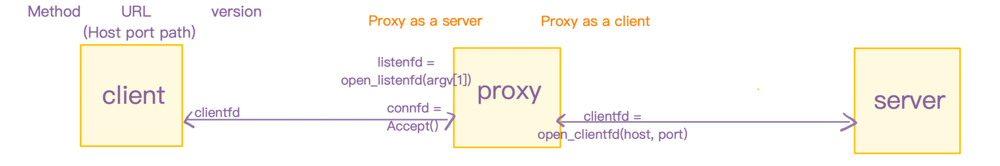

## part 1



**main:**

Build a proxy listening on given port (argv[1]) and accept new connect from client(browser or curl) and handle client request (`handle request`)in a while loop

**handle_request:**

first parse request `GET http://www.cmu.edu/hub/index.html HTTP/1.1` to get `method` `host` `path` and `version`,

then using `rio_readlineb` read request from client and send request line `GET /hub/index.html HTTP/1.0` and some request headers to server through clientfd: `,`ps: built our own request headers `Host `, `User-agent `, `Connection `, `Proxy-connection`,

finally using `rio_readnb` read the response from server and forward to client. Not all content on the web is ASCII text. Much of the content on the web is binary data, such as images and video.` rio_readnb` can read all data including binary content, so using `rio_readnb` instead of `rio_readlineb` .

## part 2

- building thread version concurrent proxy
- passing a pointer in thread instead a local variable in case of race condition:

  ```c
      connfdp = Malloc(sizeof(int));
      *connfdp = Accept(listenfd, (SA*)&clientaddr, &clientlen);
      Pthread_create(&tid, NULL, thread, connfdp);
  ```

## part 3

### Thread

#### cache struct

set up a `cache_t` struct, it has a `cache_block` list `cache_list` and a `current_cache_num` using to record the index of the cache block list that can be added the next cache data. 

According `#define MAX_CACHE_SIZE 1049000` and `#define MAX_OBJECT_SIZE 102400`, we found `MAX_CACHE_SIZE` is nearly 10 times of `MAX_OBJECT_SIZE` and "**When calculating the size of its cache, your proxy must only count bytes used to store the actual web objects; any extraneous bytes, including metadata, should be ignored.** "we can let the list only has 10 blocks and each block's data size is `MAX_OBJECT_SIZE` (only has `MAX_OBJECT_SIZE` char)--- `char data[MAX_OBJECT_SIZE];`

```c
typedef struct {
    int current_cache_num;
    cache_block cache_list[MAX_OBJECT_NUM];
} cache_t;
```

`cache_block` has data:

```c
typedef struct {
    char url[MAXLINE];
    char data[MAX_OBJECT_SIZE];
    size_t size;
    int timestamp;
} cache_block;
```

### read-write problem

We only have one cache, add_cache is equal to write to cache, 
query_cache is equal to read cache. so we can use one semaphore to protect cache_t as a whole thing instead of use mutiple semaphores to protect sepratate cache blocks

```c
// reader-priority.c - 第一类读者-写者问题的解答，读者优先级高于写者
/* 全局变量 */
int readcnt; /* 共享变量，记录当前正在读取的读者数量 */
sem_t mutex, w; /* 两个信号量，分别用于互斥访问 readcnt 和写者优先级 */

void reader(void) {
    while (1) {
        P(&mutex);
        readcnt++;
        if (readcnt == 1)
            P(&w); /* 阻塞写者 */
        V(&mutex);

        /* 读取数据 */

        P(&mutex);
        readcnt--;
        if (readcnt == 0)
            V(&w); /* 释放写者 */
        V(&mutex);
    }
}

void writer(void) {
    while (1) {
        P(&w); /* 阻塞读者和写者 */
        /* 写入数据 */
        V(&w); /* 释放读者和写者 */
    }
}
```

we choose using `mutex` protect `readcnt`, `mutex_ts` protect `timestamp`, `w` protect critical section.

I didn't protect timestamp in `add_cache`, because only one writer can use the cache at the same time, no other writer no read, the entire `add_cache` is protected by `w` so we can not protect `timestamp` in it.

Because read and write both seems to uesd the object, so we add `timestamp` both in `add_cache` and `query_cache`(only when query success)

when we find url in our cache, we must tranfer data through `rio_t client_rio` which has binded with connfd.

### notice 1

- add new cache_block, don't direct

  ```c
    cache_block block = cache->cache_list[0]; // <-- Makes a copy
    strncpy(block.url, url, MAXLINE - 1);
    block.size = size;
  ```

  This changes block (a local copy), not the cache_list[0] inside cache.
  When your function ends, those changes are lost.
- how to fix

  1. Work directly on the cache array

     ```c
     strncpy(cache->cache_list[0].url, url, MAXLINE - 1);
     cache->cache_list[0].size = size;
     ```

  2. Or, if you want to use a variable, use a pointer

     ```c
     cache_block *block = &cache->cache_list[0]; // Pointer to the actual block
     strncpy(block->url, url, MAXLINE - 1);
     block->size = size;
     ```

- Rule of thumb:
  If you want changes to stick, use a pointer to the original struct (or modify it directly). If you copy it into a local variable, you’re working on a separate memory region.

## Aboubt test

**autotest**

```c
make
./driver.sh
```

**test files individual**

in one terminal A

```c
~/project/proxylab$ make clean
~/project/proxylab$ make
~/project/proxylab$ ./proxy
```

in terminal B

```c
~/project/proxylab/tiny$ ./tiny 8000
```

in terminal C

```c
~/project/proxylab$ curl -x localhost:5050 http://localhost:8000/home.html
```

## NOTICE

### Don't use any wrapper function unless change csapp.c

> Ideally your HTTP request parser will be fully robust according to the relevant sections of RFC 1945, except for one detail: while the specification allows for multiline request fields, your proxy is not required to properly handle them. Of course, your proxy should never prematurely abort due to a malformed request.

```c
// csapp.h
void Close(int fd) {
    int rc;

    if ((rc = close(fd)) < 0)
        unix_error("Close error");
}
void unix_error(char* msg) /* Unix-style error */
{
    fprintf(stderr, "%s: %s\n", msg, strerror(errno));
    exit(0);
}
```

From the code we can see if the wrapper function run into error, it will call `unix_error` that leads to direct exit, this is not accept in proxy project, so we either choose to not using wrapper function(function name start with upper case) or comment out `exit(0)`in `unix_error`

### the use of `->` and `.` in struct

- For a pointer point tp a struct, you can use `->` to access its argument
`cache_block *block = &cache->cache_list[0];`  `block->size`
- For a struct, you use `.` `cache->cache_list[0].size`

### `rio_readlineb` and `rio_readnb`

The RIO (Robust I/O) package provides buffered input/output functions for C programs, particularly beneficial for network applications to handle issues like short counts (where a `read` or `write` operation transfers fewer bytes than requested). 

**`rio_readlineb` and `rio_readnb` are two key buffered input functions within RIO, designed for different purposes: **

`rio_readlineb(rio_t *rp, void *usrbuf, size_t maxlen)` (read line, buffered)

- **Purpose**: Reads a text line from a file descriptor (fd) into a user-provided buffer (usrbuf).
- **Termination conditions**:
  - Reads up to a maximum length (maxlen) of bytes.
  - Stops when a newline character (\n) is encountered.
  - Stops when the end-of-file (EOF) is reached.
- **Behavior**:
  - Includes the newline character in the buffer.
  - Truncates long lines and properly null-terminates the buffer.
- **Use cases**: Ideal for reading text-based data, like HTTP headers or configuration files, where lines are terminated by newlines. 

`rio_readnb(int fd, void *usrbuf, size_t n)` (read N bytes, buffered)

- **Purpose**: Reads a specified number of bytes (n) from a file descriptor (fd) into a user-provided buffer (usrbuf).
- **Termination conditions**:
  - Reads exactly n bytes.
  - Stops when the end-of-file (EOF) is reached.
- **Behavior**:
  - Returns a short count (less than n bytes) only on encountering EOF.
- **Use cases**: Primarily used for reading binary data or when you know the exact number of bytes to read, such as reading the body of an HTTP response or data blocks. 


**Key differences summarized**

| Feature          |rio_readlineb                |rio_readnb                        |
| ---------------- |-----------------------------|----------------------------------|
|Purpose           | Reads a line of text        | Reads a specified number of bytes|
|Termination       | newline (\n), EOF, or maxlen limit| n bytes read or EOF        |
|Data Type|Text data |Binary data or when exact byte count is needed|

**Important Note**: Both `rio_readlineb` and `rio_readnb` can be interleaved on the same file descriptor. However, it's not recommended to interleave buffered RIO functions (`rio_readlineb`, `rio_readnb`) with unbuffered RIO functions (`rio_readn`) on the same descriptor.

### `memcpy` and `strcpy`

|Feature | strcpy |memcpy |
|--------|--------|-------|
|Data Type |Specific to null-terminated strings|Can copy any data type (strings, integers, structs, binary data, etc.)|
|Termination|Stops when a null terminator is encountered(The null terminator itself is also copied to the destination)|Copies a specified number of bytes, ignoring null terminators|
|Length Check|No length checking; prone to buffer overflows|Requires the number of bytes to be copied as an argument|
|Efficiency|Typically slower as it needs to scan for the null terminator|Generally faster, especially for larger data blocks|
|Overlapping Memory|Behavior is undefined if source and destination overlap|Behavior is undefined if source and destination overlap (use memmove instead)|

### `strcpy` and `strncpy` and `\n`

strcpy and strncpy are both standard C library functions for copying strings, but they handle string termination and buffer boundaries differently. 

`strcpy(char *dest, const char *src)`
The strcpy function copies a null-terminated string from a source memory location to a destination memory location. 
- Null Termination: Copies characters until it encounters a null terminator (\0), and also copies the null terminator itself.
Buffer Overflows: Does not perform bounds checking and is susceptible to buffer overflows if the destination buffer isn't large enough to hold the entire source string.
- Undefined Behavior: Behavior is undefined if the source and destination memory regions overlap.
- Security Risk: The lack of bounds checking makes strcpy a security risk, as malicious input can potentially overwrite memory outside the intended buffer. 

```c
char source[] = "Hello World";
char destination[10]; 
strcpy(destination, source); // Potential buffer overflow: destination is too small
```

`strncpy(char *dest, const char *src, size_t n)`
The strncpy function copies a specified number of characters from a source string to a destination string. 
- Fixed Length: Copies at most n characters from the source string. If the source string is shorter than n, the destination buffer is padded with null characters.
- No Automatic Null Termination: If the source string is longer than or equal to n, strncpy does not automatically append a null terminator to the destination string. You need to manually add the null terminator if you intend to treat the destination as a null-terminated string.
- Buffer Overflow Prevention: It provides some protection against buffer overflows by limiting the number of characters copied. 
  
```c
char source[] = "Hello World";
char destination[10];
strncpy(destination, source, sizeof(destination) - 1); // Copy at most 9 characters
destination[sizeof(destination) - 1] = '\0'; // Manually null terminate 
```

|Comparison|Feature |strcpy|strncpy|
|----------|--------|------|-------|
|Buffer Overflow Risk|High, if destination is smaller than the source string|Lower, but still possible if the destination buffer is not properly sized to include the null terminator.|
|Null Termination|Automatically null-terminates the destination string.|Does not automatically null-terminate if the source string is longer than or equal to the specified number of characters to copy. Requires manual null termination.|
|Performance|May be faster if the source string is short and fits into the destination buffer.|May be slower due to padding with null characters if the source string is shorter than n.|
|Use Cases|When the destination buffer is guaranteed to be large enough.|To copy a fixed number of characters or to prevent copying beyond a certain limit, especially when dealing with fixed-size buffers or when there's a risk of buffer overflow.|

### `char *url` and `char url[MAXLINE]`

char *url is a pointer point to a array
char url[MAXLINE] is a array

> `char *strncpy(char *dest, const char *src, size_t n)`; need `dest` and `src` are pointer, why `strncpy(block.url, url, MAXLINE-1)`; can worked? `block.url` is a array not a pointer

Ah — this is a classic C “arrays vs. pointers” confusion trap.

---

#### **Key point:**

In most C expressions, **an array name automatically “decays” into a pointer to its first element**.

So if you have:

```c
char url[MAXLINE];
```

and you pass it to a function expecting `char *`, like:

```c
strncpy(url, something, MAXLINE-1);
```

what actually gets passed is:

```c
(char *) &url[0]
```

— a pointer to the first character in the array.

---

#### Why it works for `strncpy(block.url, url, MAXLINE-1)`

* `block.url` is a `char[MAXLINE]` **inside a struct**.
* When you write `block.url` in an expression, it **decays to `char *`** pointing to the first byte of that array.
* That matches the `char *dest` parameter type in `strncpy`.

So even though `block.url` is technically **not** a pointer variable,
in this function call, it **behaves** like one because of array-to-pointer decay.

---

#### When it does **not** decay

* When used with `sizeof(block.url)` → you get the actual array size in bytes.
* When used with `&block.url` → you get a pointer to the whole array (`char (*)[MAXLINE]`), which is a different type.

---

If you want, I can show you a **visual memory diagram** of `block.url` in both cases so you can see exactly what’s happening at the pointer level. That usually makes it click instantly.

Alright — let’s walk through a **visual memory diagram** for `block.url` and why
`strncpy(block.url, url, MAXLINE - 1)` works even though `block.url` is an array.

---

#### **Example struct**

```c
#define MAXLINE 8  // small for demo
typedef struct {
    char url[MAXLINE];
} cache_block;

cache_block block;
char *url = "HELLO";
```

---

#### **Memory layout**

Let’s say the compiler places `block` at address `0x1000`:

| Address  | Value | Notes                       |
| -------- | ----- | --------------------------- |
| `0x1000` | 'H'   | block.url\[0]               |
| `0x1001` | 'E'   | block.url\[1]               |
| `0x1002` | 'L'   | block.url\[2]               |
| `0x1003` | 'L'   | block.url\[3]               |
| `0x1004` | 'O'   | block.url\[4]               |
| `0x1005` | '\0'  | block.url\[5]               |
| `0x1006` | ???   | block.url\[6] (unused here) |
| `0x1007` | ???   | block.url\[7] (unused here) |

---

#### **What happens in `strncpy(block.url, url, MAXLINE-1)`?**

1. `block.url` is a **`char[MAXLINE]`**.
2. When passed to a function (except for `sizeof` or `&`), **it decays to**:

   ```
   (char *) &block.url[0]
   ```

   Which is **a pointer to the first char** in the array (`0x1000` here).
3. `strncpy` sees:

   ```c
   dest = (char *)0x1000   // start of block.url
   src  = pointer to "HELLO"
   n    = 7
   ```
4. It copies byte-by-byte from `src` into the memory starting at `0x1000`.

---

#### **When decay doesn’t happen**

* `sizeof(block.url)` → **8** (the whole array size)
* `&block.url` → type `char (*)[8]` (pointer to an array of 8 chars), not `char *`

---

#### **Why you can’t do `block.url = url`**

`block.url` is **not a pointer variable** — it’s actual memory space inside the struct.
C forbids assigning arrays directly; you must copy data in with something like `strncpy` or `memcpy`.

---

If you want, I can also show you **a diagram of `char *url` vs `char url[]`** so you can see exactly why one is assignable and the other isn’t. That’s the other half of the puzzle.

Alright — let’s compare **`char url[]`** vs **`char *url`** side by side,
with diagrams so you can see why `block.url = url` doesn’t work.

---

#### **1. `char url[]` — array of characters**

```c
char url[] = "HELLO";
```

Memory (assuming starting at `0x1000`):

| Address | Value | Notes   |
| ------- | ----- | ------- |
| 0x1000  | 'H'   | url\[0] |
| 0x1001  | 'E'   | url\[1] |
| 0x1002  | 'L'   | url\[2] |
| 0x1003  | 'L'   | url\[3] |
| 0x1004  | 'O'   | url\[4] |
| 0x1005  | '\0'  | url\[5] |

Here, `url` is **the actual storage** — an array of 6 chars.

* Its name (`url`) **decays to a pointer** to the first element (`&url[0]`) in most expressions.
* But it is **not a variable holding an address** — it’s a fixed block of memory.
* This is why you **cannot reassign** it.

---

#### **2. `char *url` — pointer to characters**

```c
char *url = "HELLO";
```

Memory:

| Address | Value  | Notes                             |
| ------- | ------ | --------------------------------- |
| 0x2000  | 0x5000 | pointer value (address of string) |
| 0x5000  | 'H'    | string data                       |
| 0x5001  | 'E'    |                                   |
| 0x5002  | 'L'    |                                   |
| 0x5003  | 'L'    |                                   |
| 0x5004  | 'O'    |                                   |
| 0x5005  | '\0'   |                                   |

Here, `url` is a **variable holding an address**.

* You can make it point to something else:
  `url = another_string;`
* The actual characters live elsewhere (often in read-only memory if it’s a string literal).

---

#### **Why `block.url = url;` fails**

If `block.url` is declared as:

```c
char url[MAXLINE];
```

it’s **like case 1** — an embedded, fixed-size array in the struct.
Arrays in C are **not assignable**; you must copy their contents:

```c
strncpy(block.url, url, MAXLINE - 1);
block.url[MAXLINE - 1] = '\0';
```

If you wanted to make it assignable, you’d need:

```c
char *url;
```

inside your struct — then `block.url = url;` would compile, but you’d have to manage the memory (malloc/free).

---

If you want, I can also show you **exactly what changes in memory** if you switch your struct’s `char url[MAXLINE]` to `char *url` so you can decide which is better for your cache. That choice affects both performance and safety.